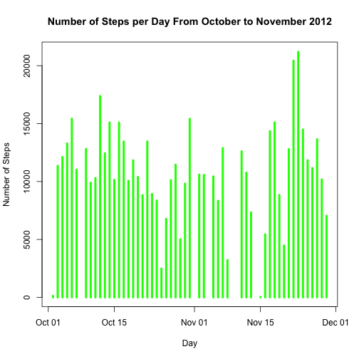
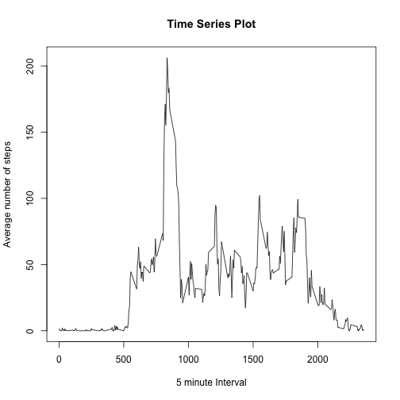
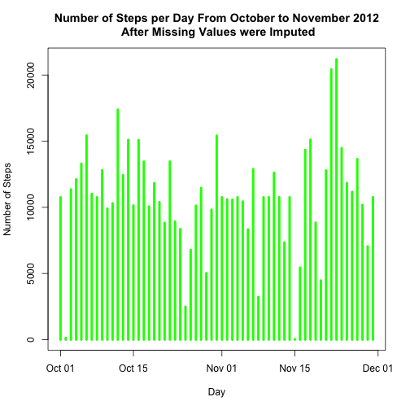
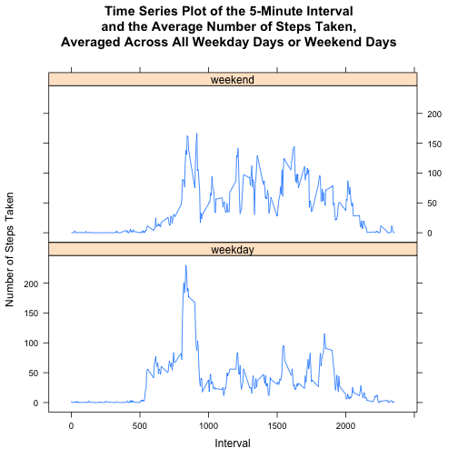

## Loading and preprocessing the data
Unzip **activity.zip** and load it into the memory.

```r
unzip(zipfile="activity.zip")
actData<-read.csv("activity.csv")
head(actData)
```

```
##   steps       date interval
## 1    NA 2012-10-01        0
## 2    NA 2012-10-01        5
## 3    NA 2012-10-01       10
## 4    NA 2012-10-01       15
## 5    NA 2012-10-01       20
## 6    NA 2012-10-01       25
```
Reassign the date column from string format to date format.

```r
actData$date <- as.Date(actData$date,"%Y-%m-%d")
```
## What is mean total number of steps taken per day?
Historam of the total number of stpes taken each day

```r
totStepsPerDay <- aggregate(steps ~ date, data = actData, sum)
plot(totStepsPerDay$date, totStepsPerDay$steps, main="Number of Steps per Day From October to November 2012", xlab="Day", ylab="Number of Steps", type="h", lwd=4, col="green")
```

 

The **mean** total number of steps taken per day:

```r
mean(totStepsPerDay$steps)
```

```
## [1] 10766.19
```
The **median** total number of steps taken per day:

```r
median(totStepsPerDay$steps)
```

```
## [1] 10765
```

## What is the average daily activity pattern?
Time series plot of the 5 minute interval(x-axis) and the average number of steps taken, averaged across all days (y-axis)

```r
avgStepsByInterval <- aggregate(steps ~ interval, data = actData, mean)
plot(avgStepsByInterval$interval, avgStepsByInterval$steps, type="l", main = "Time Series Plot", xlab="5 minute Interval", ylab="Average number of steps")
```

 

The 5-minute interval, on average across all the days, contains the maximum number of steps:

```r
avgStepsByInterval[avgStepsByInterval$steps==max(avgStepsByInterval$steps),]
```

```
##     interval    steps
## 104      835 206.1698
```

## Imputing missing values
The total number of missing values in the dataset:

```r
nrow(actData[is.na(actData$steps),])
```

```
## [1] 2304
```
New dataset with the missing value filled with the mean for that 5-minute interval:

```r
# Merge the activity records with the mean for that 5-minute interval 
newActData<-merge(actData, avgStepsByInterval, by='interval', all.y=F)
# Fill the NA with the mean
newActData$steps.x[is.na(newActData$steps.x)] <- as.integer(
        round(newActData$steps.y[is.na(newActData$steps.x)]))
# Remove the unused columns
newActData<-newActData[c('interval','steps.x', 'date')]
# Rename the column name
names(newActData)<-c('interval','steps','date')
# Populate the new dataset filled with the mean.
head(newActData)
```

```
##   interval steps       date
## 1        0     2 2012-10-01
## 2        0     0 2012-11-23
## 3        0     0 2012-10-28
## 4        0     0 2012-11-06
## 5        0     0 2012-11-24
## 6        0     0 2012-11-15
```

Historam of the total number of stpes taken each day for the new dataset.

```r
newTotStepsPerDay <- aggregate(steps ~ date, data = newActData, sum)
plot(newTotStepsPerDay$date, newTotStepsPerDay$steps, main="Number of Steps per Day From October to November 2012\n After Missing Values were Imputed", xlab="Day", ylab="Number of Steps", type="h", lwd=4, col="green")
```

 

The **mean** total number of steps taken per day:

```r
mean(newTotStepsPerDay$steps)
```

```
## [1] 10765.64
```
The **median** total number of steps taken per day:

```r
median(newTotStepsPerDay$steps)
```

```
## [1] 10762
```

Yes, both new mean and median are slightly **different** from the first part of the assignment.
The imputing missing data on the estmates of the total daily number of steps with the mean for the 5-minute interval does not have much impacts on the new mean and median estimation.

## Are there differences in activity patterns between weekdays and weekends?
Add a new factor variable into the new dataset with two levels--"weekday" and "weekend".

```r
weekend<-weekdays(as.Date(newActData$date)) %in% c("Saturday", "Sunday")
newActData$day_type<-"weekday"
newActData$day_type[weekend==TRUE]<- "weekend"
newActData$day_type<-as.factor(newActData$day_type)
str(newActData)
```

```
## 'data.frame':	17568 obs. of  4 variables:
##  $ interval: int  0 0 0 0 0 0 0 0 0 0 ...
##  $ steps   : int  2 0 0 0 0 0 0 0 0 0 ...
##  $ date    : Date, format: "2012-10-01" "2012-11-23" ...
##  $ day_type: Factor w/ 2 levels "weekday","weekend": 1 1 2 1 2 1 2 1 1 2 ...
```


A panel plot containing a time series plot (i.e. type = "l") of the 5-minute interval (x-axis) and the average number of steps taken, averaged across all weekday days or weekend days (y-axis). 


```r
library(lattice)
avgStepsByDay<-aggregate(steps ~ interval + day_type, data=newActData, mean)
xyplot(
        steps ~ interval | day_type,
        avgStepsByDay,
        type = "l",
        layout = c(1,2),
        main = "Time Series Plot of the 5-Minute Interval\nand the Average Number of Steps Taken,\nAveraged Across All Weekday Days or Weekend Days",
        xlab = "Interval",
        ylab = "Number of Steps Taken"
)
```

 
